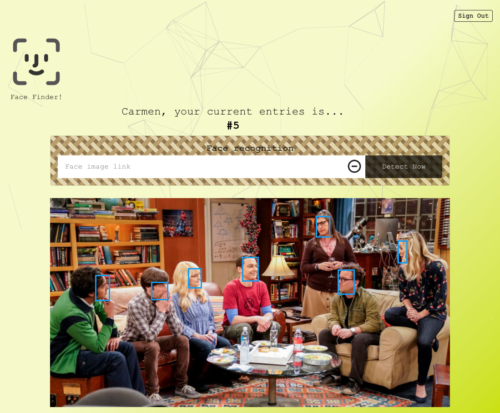
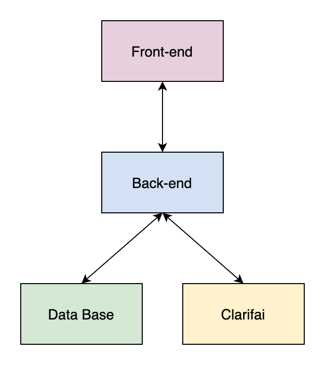
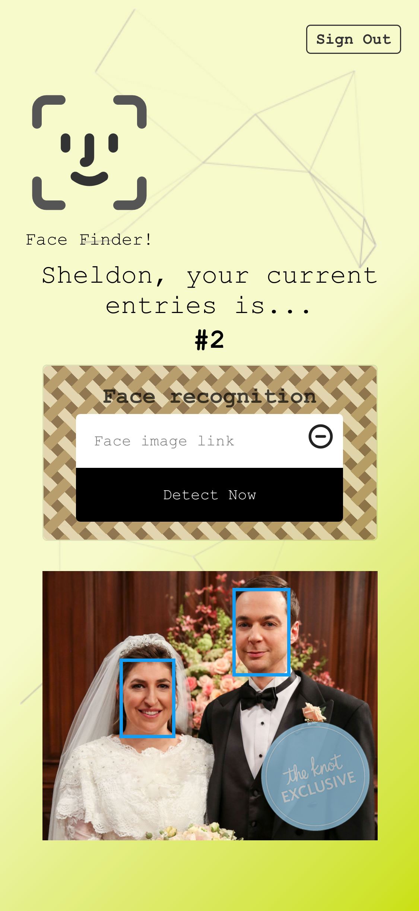
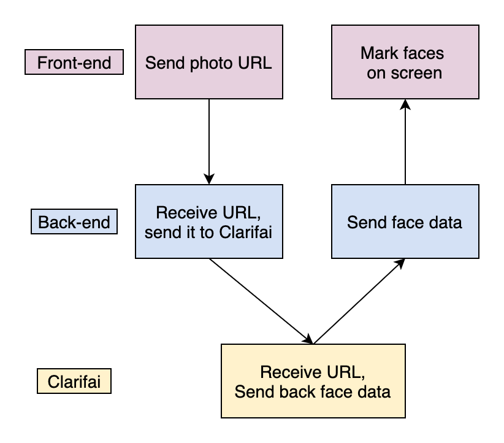
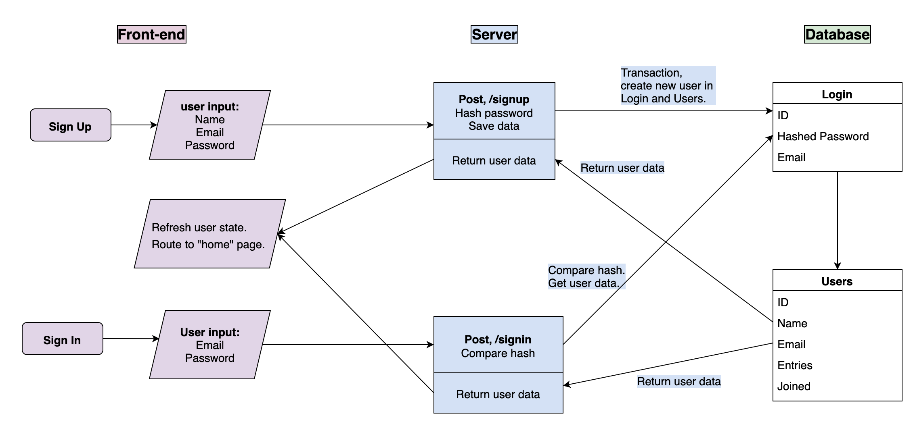
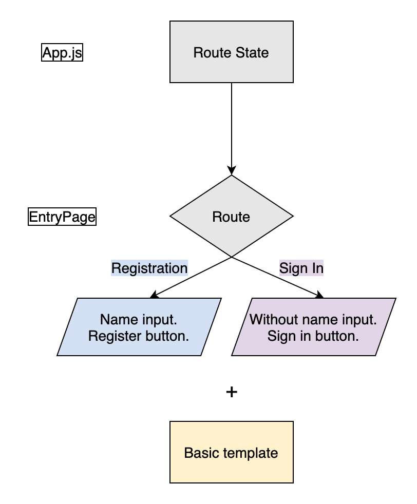
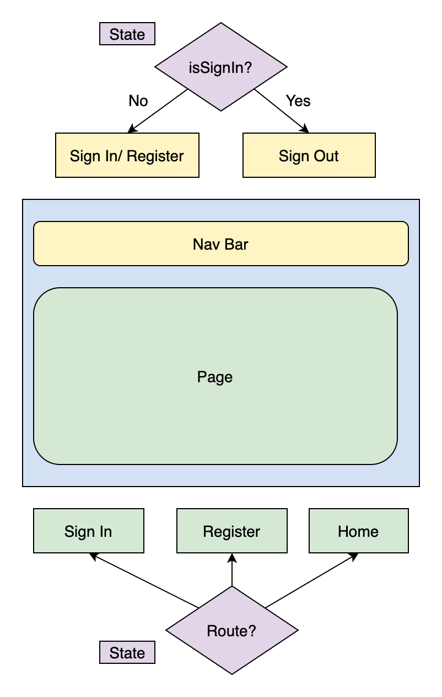
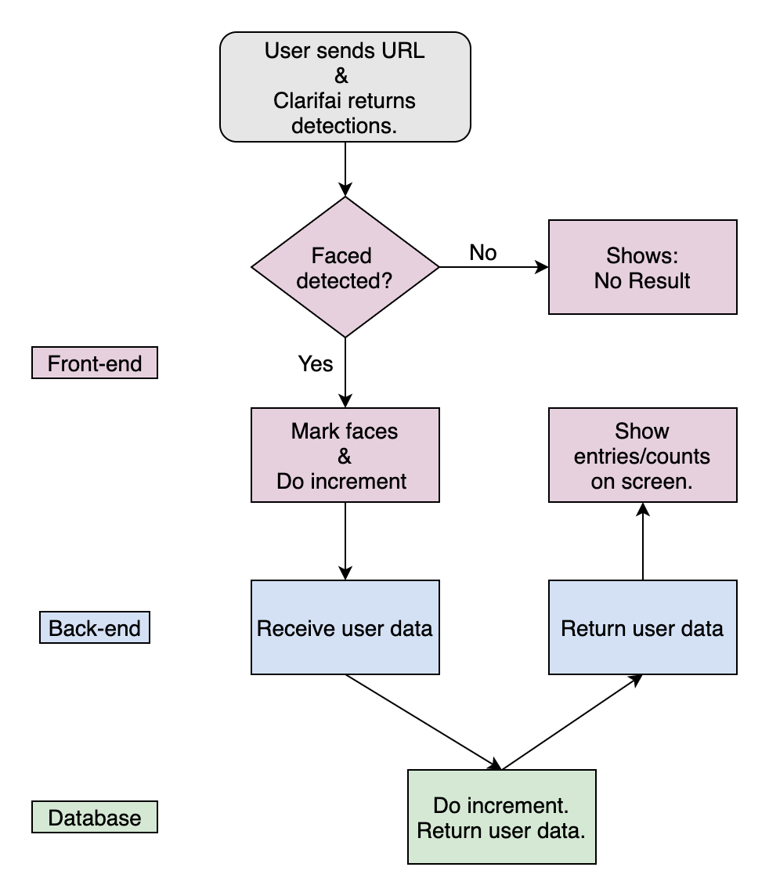
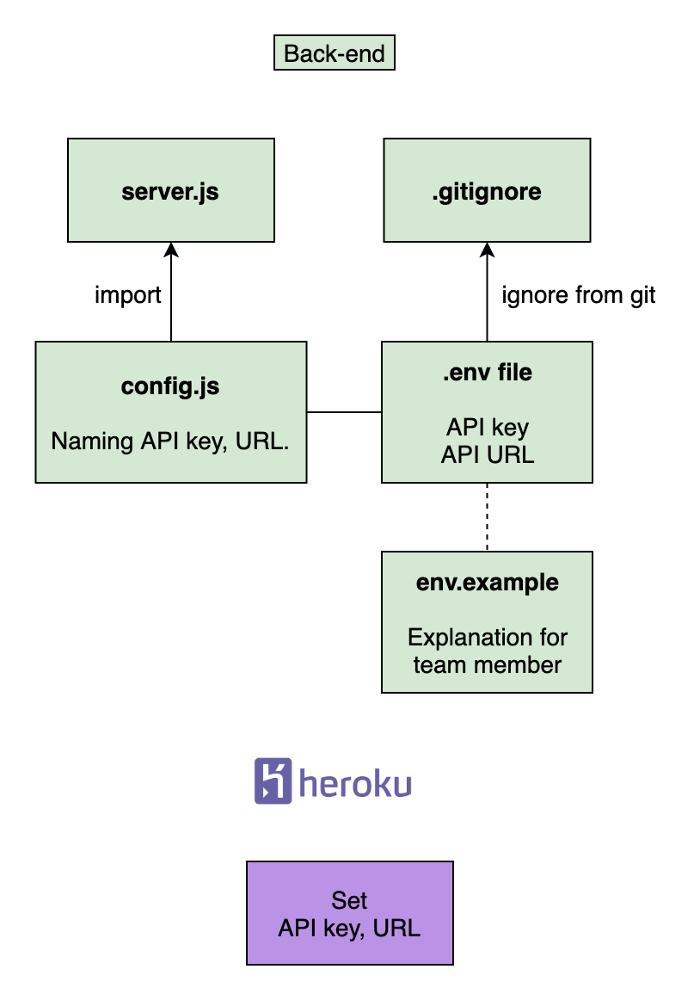

# Smart Computer - AI Face Detection 👦 👧

### [中文版README](https://github.com/yuwen-c/smartcomputer/blob/master/README_Mandarin.md)

### Detecting faces by simply sending a photo.
### AI detection technique using Clarifai API.

### 🔆 [see live](https://yuwen-smartcomputer.netlify.app/)


<h2 align="center">
  
  <br>
</h2>


## How to use

<div align="center">
  
  <br>
</div>

- After sign in or registration, send an URL of a picture with faces, this app can recognize and mark them.
- The user's entries/ counts will be updated everytime with sending a photo, and then shows on screen.

## Structures
- Frond-end website exchanges data with back-end server, also, back-end server connects with database and Clarifai API.
- back-end server goes [here](https://github.com/yuwen-c/smartcomputerAPI)
<div align="center">
  
  <br>
</div>

## Features 📝

### API Cloud service
✨ Connecting Clarifai's face recognition API, sending back data and showing on front-end website.


### Structure
✨ Frond-end website using React.js.\
－Similar to Javascript syntax.\
－The whole app combines small components which are independent and reusable.\
✨ [Back-end server](https://github.com/yuwen-c/smartcomputerAPI) using node.js, express.js.\
－Based on Javascript and powerful, can build a server quickly.\
✨ Connecting front-end and back-end with RestfulAPI.\
－Higher readability, easy to debug. Every endpoint is seperated and can be combined into multiple logics with flexibility.\
✨ Saving user data in PostgreSQL.\
✨ Connecting database with server using knex.\
－Clear documentation. Powerful.

### Security
🔐 Seperating Clarifai API key from back-end server code and by storing it as environment variable. Also, registering it in ```gitignore``` to prevent being tracking.\
🔐 Clarifai API key setting on Heroku after deployment.\
🔐 Hash user's password with Bcrypt.\
🔐 Storing password and name to seperate tables, reduce change of data leakage.\
🔐 Using ```dotenv``` in development.\
－Easy to seperate confidential data from code.

### Responsive website and Special effects
✨ Good user experience on both mobile and desktop.\
✨ Different layouts on mobile and desktop using Tachyons.\
✨ Dynamic background using ```react-particles-js```.\
✨ Hover effect using ```react-tilt```.

### Deployment
✨ Front-end deployment to Netlify.\
－Suitable for front-end website without waiting for awaken.\
✨ Back-end deployment to Heroku.\
－Easy to maintain and operate. Works well for a low-traffic website.


## Preview

- A detection screenshot on desktop showing user's name, entries/ counts, and the faces are marked.

<h2 align="center">
  
  <br>
</h2>

- A detection screenshot on mobile. The picture size is adapted to screen size.

<h2 align="center">
  
  <br>
</h2>

## How was Smartcomputer built?

### API cloud service
- The URL is sent from front-end to back-end, then to Clarifai face detection API. 
- The detection result is sending back from Clarafai and showing on screen.

<div align="center">
  
  <br>
</div>

### Register, Sign In

- Connections between front-end, back-end and database in register step and sign in step. 

<div align="center">
  
  <br>
</div>

- Creating new user in both Login and Users tables with transaction in registration step.
- Stroing hashed password in Login table.

### Merging Registration and Sign In pages to a single component
- Since the two pages are quite similar, merge two components to one, don't repear yourself.

<div align="center">
  
  <br>
</div>

- Rendering different contents based on ```Route``` state from ```App.js```: The registration page has a name blanket which does not exist in sign in page. Also the two buttons are named differently.
- The component is built by function component using ```useState``` and ```useEffect```, clearer syntax.

### Rendering is controlled by states

<div align="center">
  
  <br>
</div>

- Rendering nav bar according to ```isSignIn``` state.
- Rendering page according to ```route```.


### Increment on counts/ entries

<div align="center">
  
  <br>
</div>

- After Clarifai returning the detection, if there are faces, increment function is triggered and go to database to add 1 times to this user.
- After that, it will return to the front-end and display the updated entries of user on the screen. 


### environment variables in [Back-end](https://github.com/yuwen-c/smartcomputerAPI)

<div align="center">
  
  <br>
</div>

- Storing API key in ```.env``` and add it to ```gitignore``` to keep this file from being tracked.
- Naming environment variables in ```config.js``` and exporting it.
- Adding another ```env.example``` as reference for the team.
- In production stage, set API key on Heroku.


### Divide endpoints on back-end server to separate files

- Classifying endpoints, and dividing them to separate files with ```dependency injection``` syntax, making it clearer.


