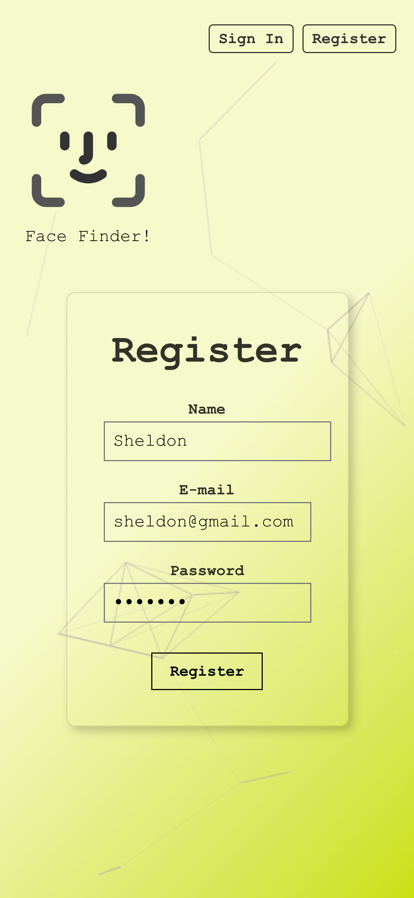

# Smart Computer
### Detecting faces in a photo by simply sending an url

<h2 align="center">
  
   
</h2>

## Features

✨ **Modern UI** for both mobile and desktop\
✨ Built by **React.js**\
✨ Styled with **Tachyons**\
✨ Dynamic background using react-particles-js\
✨ Hover effect using react-tilt\
✨ Face recognition functionality built by **Clarifai API**\
✨ Backend built with **node.js**, **express.js**\
✨ Using **RestfulAPI**\
✨ Saving user data in **PostgreSQL**\
✨ Password hashed by **Bcrypt**\
✨ Front-end deployed to **Netlify**\
✨ Back-end deployed to **Heroku**

## How to use?

- Register as a member.

<h2 align="center">
  
   
</h2>

- Find a picture of famous person you like in google.
- Paste the url of that photo in the box and submit.
- The faces will be marked out by seconds.

<h2 align="center">
  
   
</h2>
