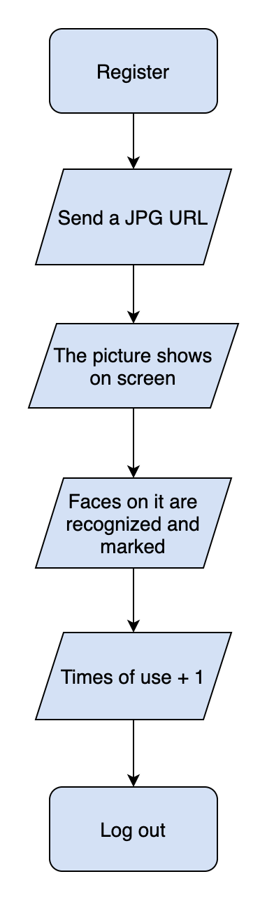

# Smart Computer - AI Face Detection 👦 👧

## [中文版README](https://github.com/yuwen-c/dieta/blob/master/README_Mandarin.md)

## Detecting faces by simply sending a photo.
## AI detection technique using Clarifai API.

## 🔆 [see live](https://yuwen-smartcomputer.netlify.app/)
## back-end server goes [here](https://github.com/yuwen-c/smartcomputerAPI)


<h2 align="center">
  
  <br>
</h2>


## How to use

<div align="center">
  
  <br>
</div>

- After sign in or registration, send an URL of a picture with faces, this app can recognize and mark them.
- The user's entries/ counts will be updated everytime with sending a photo, and then shows on screen.

## Structures
- Frond-end website exchanges data with back-end server, also, back-end server connects with database and Clarifai API.

<div align="center">
  
  <br>
</div>

## Features 📝

### API Cloud service
✨ Connecting Clarifai's face recognition API, sending back data and showing on front-end website.


### Structure
✨ Frond-end website using React.js.
－Similar to Javascript syntax.
－The whole app combines small components which are independent and reusable.
✨ [Back-end server](https://github.com/yuwen-c/smartcomputerAPI) using node.js, express.js.
－Based on Javascript and powerful, can build a server quickly.
✨ Connecting front-end and back-end with RestfulAPI.
－Higer readability, easy to debug. Every endpoint is seperated and can be combined into multiple logics with flexibility.
✨ Saving user data in PostgreSQL.
✨ Connecting database with server using knex.
－Clear documentation. Powerful.

### Security
🔐 Seperating Clarifai API key from back-end server code and by storing it as environment variable. Also, registering it in ```gitignore``` to prevent tracing.
🔐 Clarifai API key setting on Heroku after deployment.
🔐 Hash user's password with Bcrypt.
🔐 Storing password and name to seperate tables, reduce change of data leakage.
🔐 Using ```dotenv``` in development.
－Easy to seperate confidential data from code.

### Responsive website and Special effects
✨ Good user experience on both mobile and desktop.
✨ Different layout on mobile and desktop using Tachyons.
✨ Dynamic background using ```react-particles-js```.
✨ Hover effect using ```react-tilt```.

### Deployment
✨ Front-end deployment to Netlify.
－Suitable for front-end website without waiting for awaken.
✨ Back-end deployment to Heroku.
－Easy to maintain and operate. Works well for a low-traffic website.


## Preview

- A detection screenshot on desktop showing user's name, entries/ counts, and the faces are marked.

<h2 align="center">
  
  <br>
</h2>

- A detection screenshot on mobile. The picture size is adapted to screen size.

<h2 align="center">
  
  <br>
</h2>

## How was Smartcomputer built?
