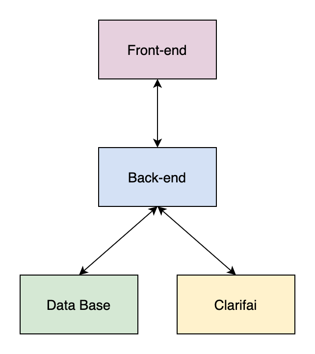
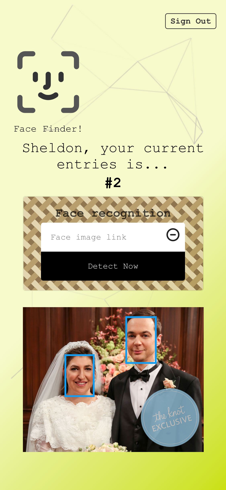
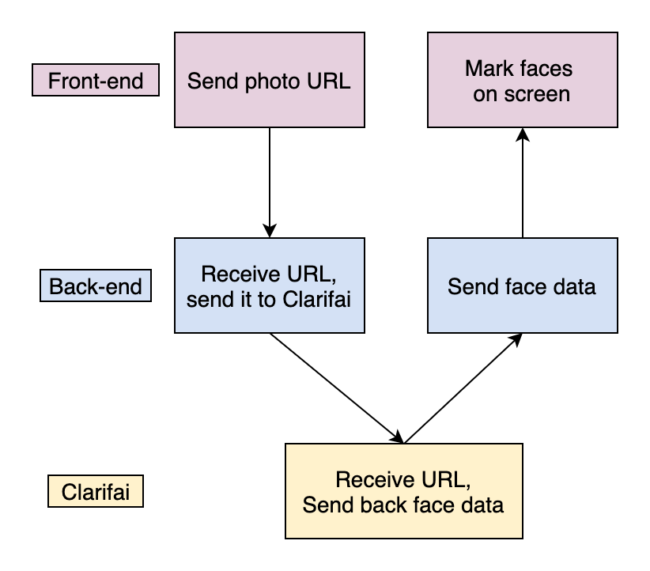
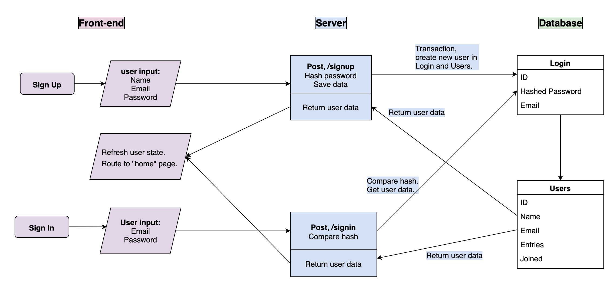
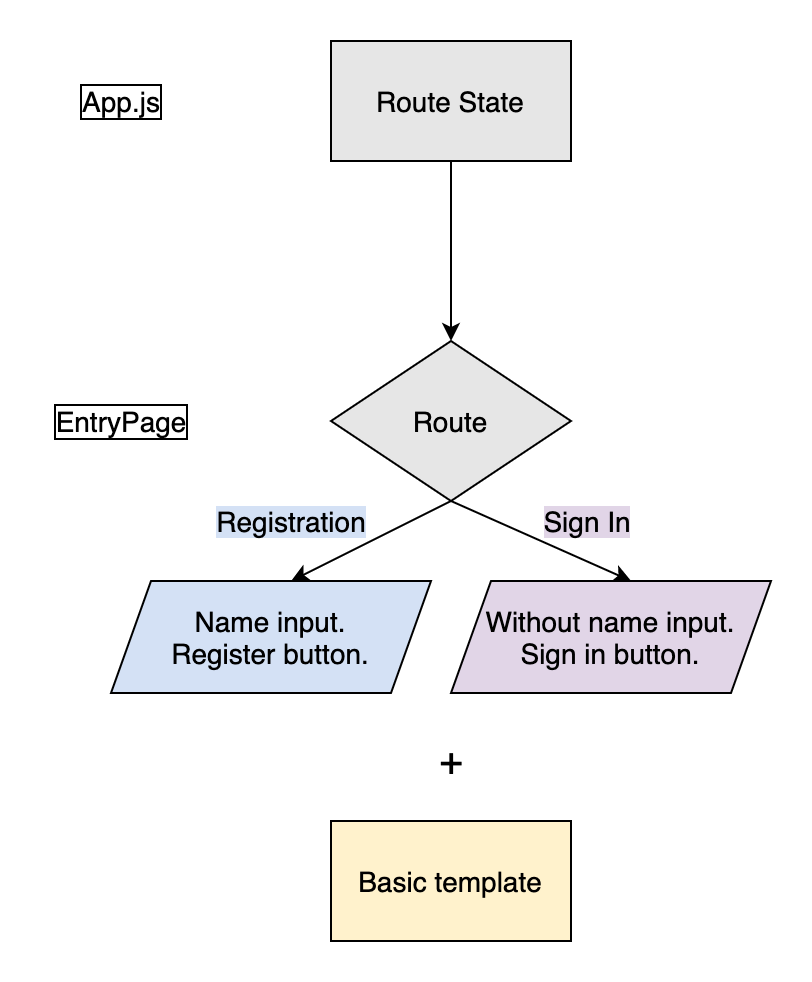
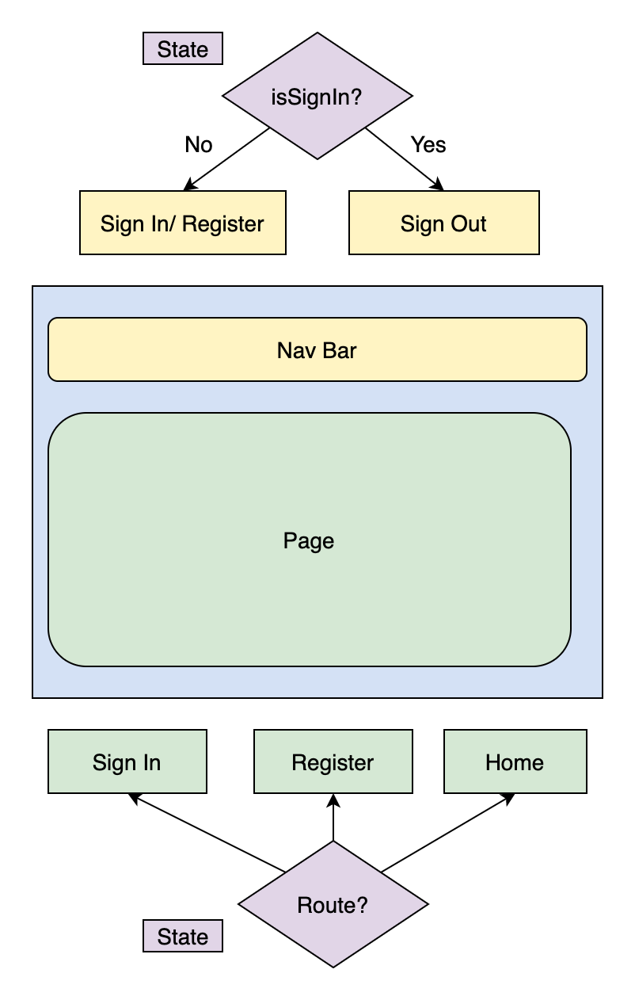
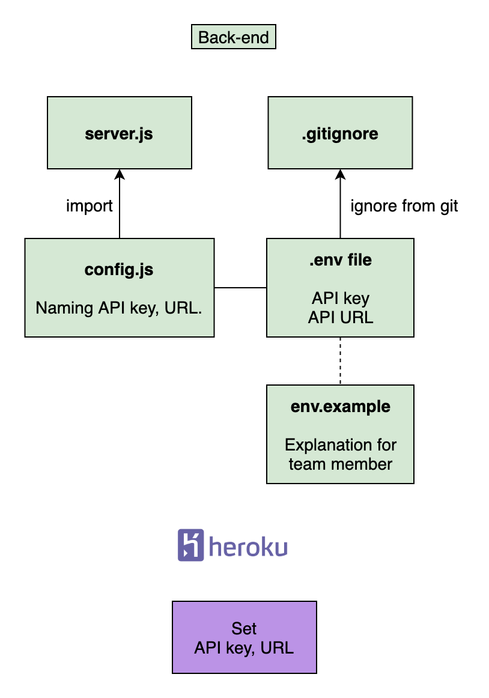

# Smart Computer - AI 人臉偵測系統 👦 👧

### [README in English](https://github.com/yuwen-c/smartcomputer/blob/master/README.md)

### 上傳照片網址，即可辨識出人臉的部分，並加以標記。
### 串接Clarifai提供的AI人臉辨識API。

### 🔆 [實際操作網站](https://yuwen-smartcomputer.netlify.app/)


<h2 align="center">
  
  <br>
</h2>

## 功能

<div align="center">
  
  <br>
</div>

- 使用者註冊或登入後，送出包含人臉的照片網址，系統可將人臉部分辨識出來，並加以標記。
- 使用次數會顯示在畫面上，隨著送出網址後即時更新。

## 整體架構
- 前端與後端相連，傳送及接收資料；後端也與資料庫、Clarifai相接，雙向交換資料。
- [後端server github](https://github.com/yuwen-c/smartcomputerAPI)
<div align="center">

  
  <br>
</div>

## 特點 📝
### API 雲端服務
✨ 連接Clarifai雲端服務的人臉辨識API，並將結果回傳、顯示於前端。

### 整體架構
✨ 前端網站使用React.js。\
－語法類似Javascript，利用多個元件組合而成，元件各自獨立且可重複使用。\
✨ [後端server](https://github.com/yuwen-c/smartcomputerAPI)利用node.js, express.js。\
－使用Javascript語言，效能強大，可快速建造一個server。\
✨ 前後端以RestfulAPI連接。\
－提高可讀性、除錯效率，分離每個端點，可彈性組合成多種邏輯。\
✨ 使用者資料儲存於PostgreSQL資料庫。\
✨ 資料庫與server以knex相接。\
－說明文件清楚，功能強大。

### 安全性 
🔐 將Clarifai API key 設為環境變數，與後端server的code分開，並放在```gitignore```，不會被git紀錄。\
🔐 Clarifai API key 部署時設定在Heroku。\
🔐 使用者密碼以Bcrypt加密。\
🔐 使用者密碼，與姓名等資料分開存放在不同table，減少資料外洩的機率。\
🔐 開發階段，使用```dotenv```。\
－方便將機密資料與code分開存放。

### 響應式前端網站及特效
✨ 手機、桌機體驗良好的前端網站。\
✨ 利用Tachyons設定達成：針對不同螢幕大小，顯示不同樣式的設計。\
✨ 動態背景採用```react-particles-js```\
✨ Hover特效採用```react-tilt```

### 部署
✨ 前端網站部署到Netlify。\
－適合部署前端網站，不需等待喚醒時間。\
✨ 後端網站部署到Heroku。\
－維護、操作容易，適合小流量網站。

## 畫面預覽

- 桌機版人臉偵測結果畫面，顯示使用者名稱、使用次數，並將人臉框出：

<h2 align="center">
  
  <br>
</h2>

- 手機版人臉偵測結果畫面，將圖片大小適應手機螢幕尺寸：

<h2 align="center">
  
  <br>
</h2>


## 詳細作法

### API 雲端服務
- 前端將照片URL送往後端，再傳到Clarifai的人臉辨識API，並將辨識結果回傳，再顯示於前端。

<div align="center">
  
  <br>
</div>

### 註冊、登入

- 註冊及登入，前端、後端及資料庫的連結：

<div align="center">
  
  <br>
</div>

- 註冊時，使用Transaction，在Login及Users表格分別創新使用者。
- 在Login表格儲存加密密碼。

### 註冊、登入頁面整合為一個component
- 這兩頁的樣式、功能有許多雷同，所以整合成一個component，Don't repeat yourself。
  
<div align="center">
  
  <br>
</div>

- 差異處，用```ternary operator```，根據從```App.js```傳來的```Route```，來判斷要回傳什麼內容：註冊頁面比登入頁面多「姓名欄位」，且一個是登入按鈕，另一個是註冊按鈕。
- 使用```useState```和```useEffect```，以function component就能儲存、改變state，且更簡潔。

### 路徑與登入狀態決定畫面呈現

<div align="center">
  
  <br>
</div>

- 根據```isSignIn``` state來決定導覽列要顯示的內容。
- 根據```route``` state來畫面會顯示Sign In/ Register 或 Home page。


### 送出圖片，辨識完成後，使用次數+1

<div align="center">
  
  <br>
</div>

- 使用者送出URL，Clarifai完成辨識並回傳。
- 如果有人臉資料，則前端會再連到後端，將使用次數+1，後端、資料庫完成+1後會回到前端，並在螢幕上顯示更新後的使用次數。


### [後端](https://github.com/yuwen-c/smartcomputerAPI)的環境變數設定 

<div align="center">
  
  <br>
</div>

- 在```.env```檔設定API key，並且加入```gitignore```以免被git追蹤。
- 以```config.js```檔為環境變數命名```process.env```，並且export。
- 另外編輯一個```env.example```，告知團隊需要設定哪些環境變數。
- 生產階段，API key直接設定在Heroku上。

### 後端server endpoint 各自獨立為一個檔案
- 配合 dependency injection，將各endpoint分類，獨立到分別的檔案中，更清楚明瞭。


